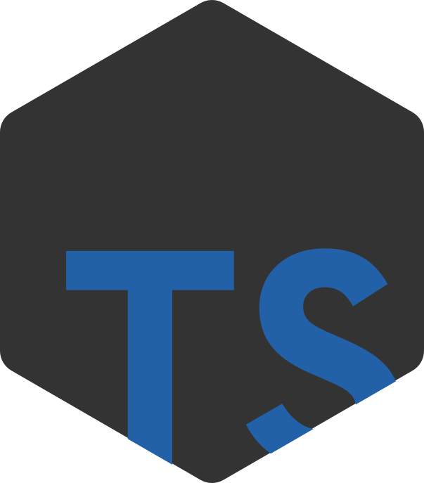

# Node Typescript Application

This is a Nodejs + Typescript application basis.

## Create a new Nodejs + Typescript application

```bash
npx create-node-ts-project my-app
cd my-app
```

## Start

Run project on production

npm

```bash
yarn start
#Or
npm run start
```

Run project on development:

```bash
yarn dev
#Or
npm run dev
```

# Step-by-step to create this project's basis

## Init

```bash
yarn init -y
```

## Install Dependencies

```bash
yarn add -D  \
 typescript  \
 ts-node     \
 @types/node
```

## Config TS

Manually create `tsconfig.json` in the root path with the following options:

```json
{
  "compilerOptions": {
    "target": "ES2020",
    "lib": ["ESNext"],
    "module": "commonjs",
    "allowJs": true,
    "outDir": "./build",
    "esModuleInterop": true
  },
  "include": ["app.ts", "src"],
  "exclude": [
    "**/*.spec.?s",
    "**/*.test.?s"
  ]
}
```

If you prefer you can create the default `tsconfig.json` running this command `npx tsc --init`.

# Executing binary (command) with [NPX](https://www.npmjs.com/package/npx):

`npx [options] <command>[@version] [command-arg]...`

`npx [options] [-p|--package <pkg>]... <command> [command-arg]...`

`npx [options] -c '<command-string>'`

`npx --shell-auto-fallback [shell]`


> Unless a --package option is specified, npx will try to guess the name of the binary to invoke depending on the specifier provided. All package specifiers understood by npm may be used with npx, including git specifiers, remote tarballs, local directories, or scoped packages.